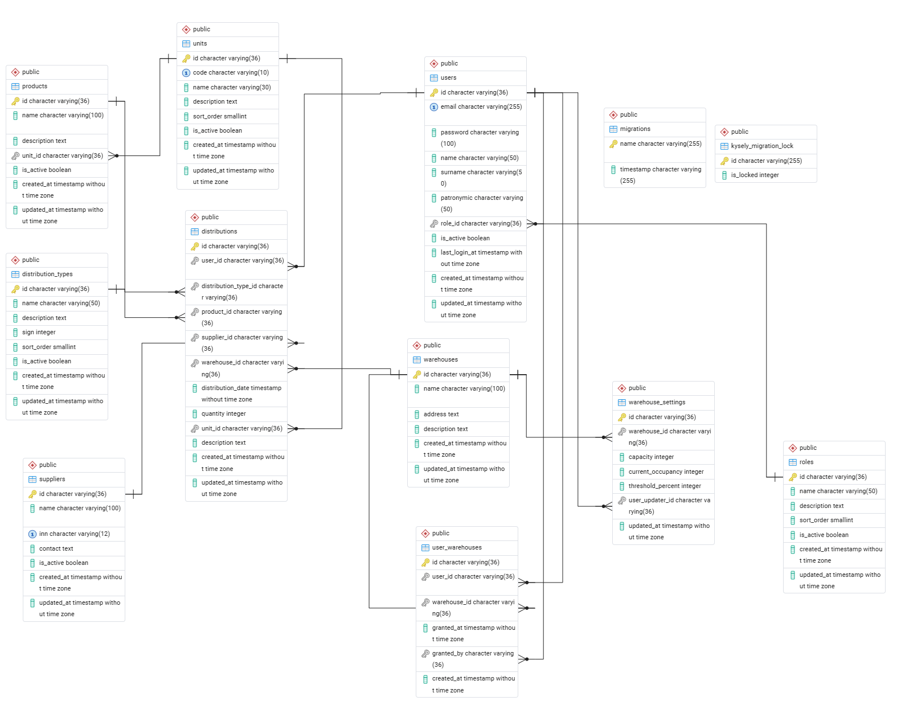

- [Описание проекта](./README.md)
# База данных

## Обзор

База данных построена на **PostgreSQL**. Все идентификаторы генерируются с помощью `gen_random_uuid()` и хранятся как строки (`varchar(36)`). Исключение — `units.code`, который использует короткие коды.

**Принципы:**
- **Soft Delete** — данные не удаляются, только деактивируются (`is_active = false`)
- **Аудит** — все изменения сохраняются для истории
- **Каскадные операции** — настроены на уровне БД

---

## ER-диаграмма

---

## Таблицы

### 1. roles (Роли пользователей)

| Поле | Тип | Ограничения | Описание |
|------|-----|-------------|----------|
| `id` | `varchar(36)` | `PRIMARY KEY` | Уникальный идентификатор (UUID) |
| `name` | `varchar(50)` | `NOT NULL` | Название роли |
| `description` | `text` | - | Описание прав и обязанностей |
| `sort_order` | `smallint` | `DEFAULT 0` | Порядок сортировки |
| `is_active` | `boolean` | `DEFAULT true` | Активность роли |
| `created_at` | `timestampz` | `DEFAULT CURRENT_TIMESTAMP` | Дата создания |
| `updated_at` | `timestampz` | `DEFAULT CURRENT_TIMESTAMP` | Дата обновления |

**Индексы:** Нет

---

### 2. users (Пользователи)

| Поле | Тип | Ограничения | Описание |
|------|-----|-------------|----------|
| `id` | `varchar(36)` | `PRIMARY KEY` | Уникальный идентификатор (UUID) |
| `email` | `varchar(255)` | `NOT NULL, UNIQUE` | Email пользователя |
| `password` | `varchar(100)` | `NOT NULL` | Зашифрованный пароль (bcrypt) |
| `name` | `varchar(50)` | `NOT NULL` | Имя |
| `surname` | `varchar(50)` | `NOT NULL` | Фамилия |
| `patronymic` | `varchar(50)` | - | Отчество |
| `role_id` | `varchar(36)` | `FK → roles(id)` | Идентификатор роли |
| `is_active` | `boolean` | `DEFAULT true` | Активность учетной записи |
| `last_login_at` | `timestampz` | `DEFAULT CURRENT_TIMESTAMP` | Дата последнего входа |
| `created_at` | `timestampz` | `DEFAULT CURRENT_TIMESTAMP` | Дата создания |
| `updated_at` | `timestampz` | `DEFAULT CURRENT_TIMESTAMP` | Дата обновления |

**Индексы:**
- `idx_users_email` — поиск по email
- `idx_users_role_id` — фильтрация по роли

---

### 3. warehouses (Склады)

| Поле | Тип | Ограничения | Описание |
|------|-----|-------------|----------|
| `id` | `varchar(36)` | `PRIMARY KEY` | Уникальный идентификатор (UUID) |
| `name` | `varchar(100)` | `NOT NULL` | Название склада |
| `address` | `text` | `NOT NULL` | Адрес склада |
| `description` | `text` | - | Описание склада |
| `created_at` | `timestampz` | `DEFAULT CURRENT_TIMESTAMP` | Дата создания |
| `updated_at` | `timestampz` | `DEFAULT CURRENT_TIMESTAMP` | Дата обновления |

**Индексы:** Нет

---

### 4. user_warehouses (Доступ пользователей к складам)

| Поле | Тип | Ограничения | Описание |
|------|-----|-------------|----------|
| `id` | `varchar(36)` | `PRIMARY KEY` | Уникальный идентификатор (UUID) |
| `user_id` | `varchar(36)` | `FK → users(id), NOT NULL` | Пользователь |
| `warehouse_id` | `varchar(36)` | `FK → warehouses(id), NOT NULL` | Склад |
| `granted_at` | `timestamp` | `DEFAULT CURRENT_TIMESTAMP` | Дата предоставления доступа |
| `granted_by` | `varchar(36)` | `FK → users(id)` | Кто предоставил доступ |
| `created_at` | `timestampz` | `DEFAULT CURRENT_TIMESTAMP` | Дата создания записи |

**Индексы:**
- `idx_user_warehouses_user_id`
- `idx_user_warehouses_warehouse_id`

**Уникальное ограничение:** `(user_id, warehouse_id)`

---

### 5. units (Единицы измерения)

| Поле | Тип | Ограничения | Описание |
|------|-----|-------------|----------|
| `id` | `varchar(36)` | `PRIMARY KEY` | Уникальный идентификатор (UUID) |
| `code` | `varchar(10)` | `NOT NULL, UNIQUE` | Короткое обозначение |
| `name` | `varchar(30)` | `NOT NULL` | Название единицы измерения |
| `description` | `text` | - | Описание |
| `sort_order` | `smallint` | `DEFAULT 0` | Порядок сортировки |
| `is_active` | `boolean` | `DEFAULT true` | Активность |
| `created_at` | `timestampz` | `DEFAULT CURRENT_TIMESTAMP` | Дата создания |
| `updated_at` | `timestampz` | `DEFAULT CURRENT_TIMESTAMP` | Дата обновления |

**Индексы:** Нет

**Данные по умолчанию:**

| code | name | description |
|------|------|-------------|
| `g` | Грамм | Единица измерения веса |
| `ml` | Миллилитр | Единица измерения объема |
| `p` | Штука | Единица измерения количества |
| `mm` | Миллиметр | Единица измерения длины |

---

### 6. products (Товары)

| Поле | Тип | Ограничения | Описание |
|------|-----|-------------|----------|
| `id` | `varchar(36)` | `PRIMARY KEY` | Уникальный идентификатор (UUID) |
| `name` | `varchar(100)` | `NOT NULL` | Название товара |
| `description` | `text` | - | Описание товара |
| `unit_id` | `varchar(36)` | `FK → units(id), NOT NULL` | Единица измерения |
| `is_active` | `boolean` | `DEFAULT true` | Активность товара |
| `created_at` | `timestampz` | `DEFAULT CURRENT_TIMESTAMP` | Дата создания |
| `updated_at` | `timestampz` | `DEFAULT CURRENT_TIMESTAMP` | Дата обновления |

**Индексы:**
- `idx_products_unit_id`

---

### 7. suppliers (Поставщики)

| Поле | Тип | Ограничения | Описание |
|------|-----|-------------|----------|
| `id` | `varchar(36)` | `PRIMARY KEY` | Уникальный идентификатор (UUID) |
| `name` | `varchar(100)` | `NOT NULL` | Название компании |
| `inn` | `varchar(12)` | `NOT NULL, UNIQUE` | ИНН поставщика |
| `contact` | `text` | - | Контактная информация |
| `is_active` | `boolean` | `DEFAULT true` | Активность поставщика |
| `created_at` | `timestampz` | `DEFAULT CURRENT_TIMESTAMP` | Дата создания |
| `updated_at` | `timestampz` | `DEFAULT CURRENT_TIMESTAMP` | Дата обновления |

**Индексы:**
- `idx_suppliers_inn`

---

### 8. distribution_types (Типы перемещений)

| Поле | Тип | Ограничения | Описание |
|------|-----|-------------|----------|
| `id` | `varchar(36)` | `PRIMARY KEY` | Уникальный идентификатор (UUID) |
| `name` | `varchar(50)` | `NOT NULL` | Название типа |
| `description` | `text` | - | Описание типа |
| `sign` | `integer` | `DEFAULT 1` | 1 — приход, -1 — расход, 0 — корректировка |
| `sort_order` | `smallint` | `DEFAULT 0` | Порядок сортировки |
| `is_active` | `boolean` | `DEFAULT true` | Активность типа |
| `created_at` | `timestampz` | `DEFAULT CURRENT_TIMESTAMP` | Дата создания |
| `updated_at` | `timestampz` | `DEFAULT CURRENT_TIMESTAMP` | Дата обновления |

**Индексы:** Нет

**Данные по умолчанию:**

| name | sign | description |
|------|------|-------------|
| Поставка | `1` | Поступление товара от поставщика |
| Убытие | `-1` | Списание товара со склада |
| Брак | `-1` | Перемещение в брак |
| Корректировка | `0` | Корректировка количества товара |

---

### 9. distributions (Товародвижение)

| Поле | Тип | Ограничения | Описание |
|------|-----|-------------|----------|
| `id` | `varchar(36)` | `PRIMARY KEY` | Уникальный идентификатор (UUID) |
| `user_id` | `varchar(36)` | `FK → users(id), NOT NULL` | Пользователь, создавший запись |
| `distribution_type_id` | `varchar(36)` | `FK → distribution_types(id), NOT NULL` | Тип перемещения |
| `product_id` | `varchar(36)` | `FK → products(id), NOT NULL` | Товар |
| `supplier_id` | `varchar(36)` | `FK → suppliers(id), NOT NULL` | Поставщик |
| `warehouse_id` | `varchar(36)` | `FK → warehouses(id), NOT NULL` | Склад |
| `distribution_date` | `timestampz` | `NOT NULL` | Дата перемещения |
| `quantity` | `integer` | `NOT NULL` | Количество |
| `unit_id` | `varchar(36)` | `FK → units(id), NOT NULL` | Единица измерения |
| `description` | `text` | - | Описание перемещения |
| `created_at` | `timestampz` | `DEFAULT CURRENT_TIMESTAMP` | Дата создания записи |
| `updated_at` | `timestampz` | `DEFAULT CURRENT_TIMESTAMP` | Дата обновления |

**Индексы:**
- `idx_distributions_user_id`
- `idx_distributions_product_id`
- `idx_distributions_warehouse_id`
- `idx_distributions_distribution_date`

---

### 10. warehouse_settings (История настроек склада)

| Поле | Тип | Ограничения | Описание |
|------|-----|-------------|----------|
| `id` | `varchar(36)` | `PRIMARY KEY` | Уникальный идентификатор (UUID) |
| `warehouse_id` | `varchar(36)` | `FK → warehouses(id), NOT NULL` | Склад |
| `capacity` | `integer` | `NOT NULL` | Вместимость склада |
| `current_occupancy` | `integer` | `DEFAULT 0` | Текущая занятость |
| `threshold_percent` | `integer` | `DEFAULT 10` | Процент для уведомления |
| `user_updater_id` | `varchar(36)` | `FK → users(id)` | Пользователь, изменивший настройки |
| `updated_at` | `timestampz` | `DEFAULT CURRENT_TIMESTAMP` | Дата изменения |

**Индексы:**
- `idx_warehouse_settings_warehouse_id`
- `idx_warehouse_settings_user_updater_id`

---

## Связи между таблицами

| Внешний ключ | Ссылается на | Тип связи | Описание |
|--------------|--------------|-----------|----------|
| `users.role_id` | `roles.id` | `ON DELETE SET NULL` | Пользователь → Роль |
| `user_warehouses.user_id` | `users.id` | `ON DELETE CASCADE` | Доступ → Пользователь |
| `user_warehouses.warehouse_id` | `warehouses.id` | `ON DELETE CASCADE` | Доступ → Склад |
| `user_warehouses.granted_by` | `users.id` | `ON DELETE SET NULL` | Доступ → Кто выдал |
| `products.unit_id` | `units.id` | `ON DELETE RESTRICT` | Товар → Единица измерения |
| `distributions.user_id` | `users.id` | `ON DELETE RESTRICT` | Перемещение → Пользователь |
| `distributions.distribution_type_id` | `distribution_types.id` | `ON DELETE RESTRICT` | Перемещение → Тип |
| `distributions.product_id` | `products.id` | `ON DELETE RESTRICT` | Перемещение → Товар |
| `distributions.supplier_id` | `suppliers.id` | `ON DELETE RESTRICT` | Перемещение → Поставщик |
| `distributions.warehouse_id` | `warehouses.id` | `ON DELETE RESTRICT` | Перемещение → Склад |
| `distributions.unit_id` | `units.id` | `ON DELETE RESTRICT` | Перемещение → Единица измерения |
| `warehouse_settings.warehouse_id` | `warehouses.id` | `ON DELETE CASCADE` | Настройки → Склад |
| `warehouse_settings.user_updater_id` | `users.id` | `ON DELETE SET NULL` | Настройки → Пользователь |

---

## Правила валидации

- `quantity` в `distributions` должен быть > 0
- `email` в `users` должен быть уникальным
- `inn` в `suppliers` должен быть уникальным
- `code` в `units` должен быть уникальным
- `sign` в `distribution_types` может быть: 1 (приход), -1 (расход), 0 (корректировка)

---

## Особенности реализации

### Мягкое удаление (Soft Delete)
- Данные **не удаляются физически** из базы данных
- Для сущностей используется флаг `is_active`
- При выборке данных по умолчанию фильтруются только активные записи
- Неактивные записи сохраняются для истории и аудита

### Идентификаторы
- Все ID генерируются через `gen_random_uuid()` на стороне базы данных
- ID хранятся как `varchar(36)` (стандартный UUID)
- Исключение: `units.code` — короткие коды (`g`, `ml`, `p`, `mm`)

### Временные поля
- Все временные поля используют тип `timestamp`
- `created_at` автоматически заполняется при создании записи
- `updated_at` автоматически обновляется при изменении записи

### Каскадные операции
- `ON DELETE RESTRICT` — запрещает удаление записи, если на нее есть ссылки
- `ON DELETE SET NULL` — устанавливает NULL при удалении связанной записи
- `ON DELETE CASCADE` — удаляет связанные записи автоматически

---

## Начальные данные

При первом запуске миграций создаются:

1. **Роли:** Администратор, Кладовщик, Бухгалтер, Неизвестно
2. **Единицы измерения:** Грамм, Миллилитр, Штука, Миллиметр
3. **Типы перемещений:** Поставка, Убытие, Брак, Корректировка
4. **Склад:** Основной склад
5. **Администратор:** `admin@warehouse.com` / `admin123`
6. **Связь администратора со складом** (по умолчанию)
7. **Тестовые товары, поставщики и перемещения**

---